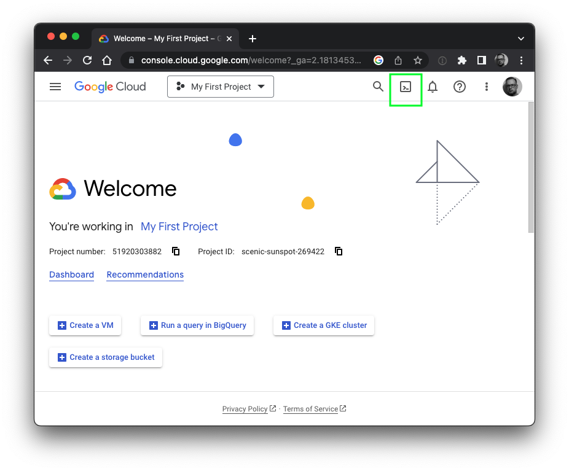
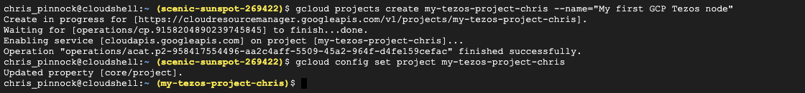
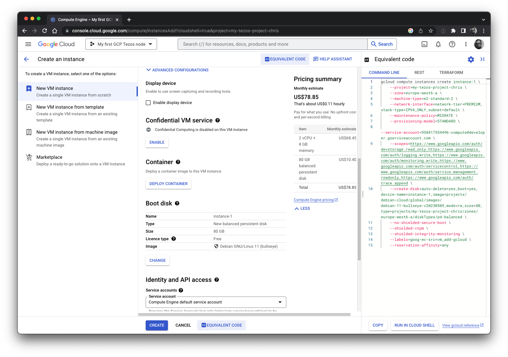
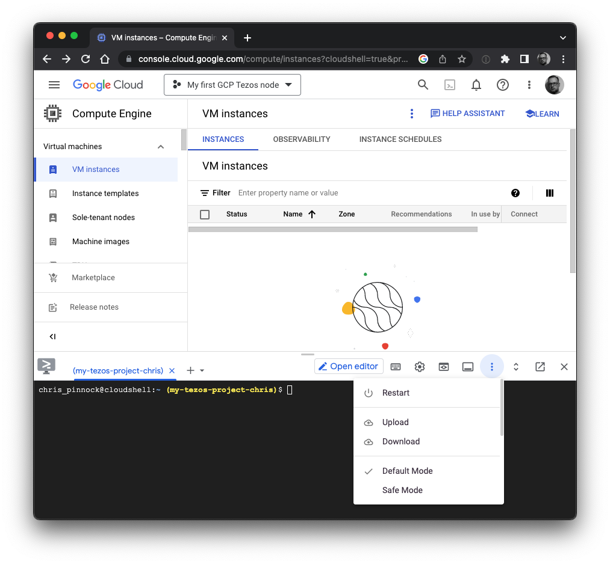

## Abstract

We install a [Tezos](https://www.tezos.com/) node on [Google Cloud Platform](https://cloud.google.com/) using the ```gcloud``` command.

## Introduction

[Tezos](https://tezos.com) is a proof-of-stake blockchain. Anyone can run a Tezos node to participate in the network and contribute to the integrity and resilience of the network. Recently I needed to bring up some Tezos nodes quickly on the [Google Cloud Platform (GCP)](https://cloud.google.com/). There are many ways to install Tezos on GCP. One can use docker images, software packages or build from source. To provision the virtual machines on GCP, one can use tools like [Terraform](https://www.terraform.io/) or [Pulumi](https://www.pulumi.com). On this occasion I wanted to get some hands-on experience with the GCP command line tool, ```gcloud```. 

As with most cloud services, it is possible to interact with GCP on the Unix or Windows command line. ```gcloud``` enables you to interactively provision services by typing commands and by extension allows you to write scripts to provision services very quickly.

GCP has the advantage that for many of its services, the web front-end offers the equivalent ```gcloud``` command line code for provisioning tasks. This makes it incredibly easy to write provisioning scripts for small projects. 

In the GCP Console, there is a feature called Google Cloud Shell in which one can run a Unix sheel and run ```gcloud```. However ```gcloud``` also runs natively on Linux, Macs and Windows machines.

In this article we will install a Tezos node completely from the command line. We will use the Google Cloud Shell in the browser, but you can follow along with ```gcloud``` installed on your machine if you want. You will need a GCP billing account either with billing credits or a payment method defined.

Please note that you may incur charges if you use the examples below. Do not forget to delete any unwanted resources that you create on GCP to avoid unexpected bills.

For more details on Tezos, please refer to the [Tezos website](https://tezos.com). Please also refer to my [article on setting up a Tezos node](https://chrispinnock.com/tezos/node/).

## Outline

We will install a Tezos node and participate in *nairobinet*. This is a test network designed to test the Nairobi protocol which will go live on June 23rd 2023. 

A node keeps the full blockchain data or a subset of it depending on the history mode. There are three history modes for a node - *archive*, *full* and *rolling*. An archive node has all the blockchain data from the first block (Genesis block) to the present day. A full node is able to provide most information about the chain but has some information summarised to save on space. A rolling node contains enough blocks so that the node can participate in the network. We will setup a rolling node because the disc space required is minimal.

We will use the GCP Compute Engine to bring up a virtual machine with Debian 11 Linux. We will install [Octez](https://tezos.gitlab.io), the reference implementation of the Tezos protocol and we will install it using [binary packages](https://pkgbeta.tzinit.org) supplied by the Tezos Foundation.

Alternatively, you could choose to participate in the production Tezos network *mainnet* but it will take longer to download and import the snapshot. 

The resources for this article can be found at [GitHub](https://github.com/drchrispinnock/gcp-node-example). 

## Installation

1\. Login to the [Google Cloud Platform Console](https://console.cloud.google.com/) with your Google account. If this is your first login, you will need to activate the account and set up a billing method[^2].

[^2]: You may be eligible for credits if you are new user.

2\. Start the Cloud Shell. The Cloud Shell runs in a web browser. You can start it by clicking the Cloud Shell button at the top right of the console, here highlighted in green:



Alternatively, you can install ```gcloud``` on your machine and work from there. You can download it from [Google](https://cloud.google.com/sdk/docs/install). Follow the installation instructions[^1] and once installed, use ```gcloud init``` to setup the software for your GCP account.

[^1]:  ```gcloud``` [documentation](https://cloud.google.com/sdk/gcloud/reference) and [cheat sheet](https://cloud.google.com/sdk/docs/cheatsheet)

3\. By running commands in the Cloud Shell, add a new project to GCP, then set it as the default so that future commands run on the project. In the examples below we split lines with \\, but you will need to be careful cutting and pasting directly from this document. To make life easier, we have supplied the commands in a [text file](https://github.com/drchrispinnock/gcp-node-example/blob/main/commands.txt).

```
gcloud projects create my-tezos-project-chris \
	--name="My first GCP Tezos node"
gcloud config set project my-tezos-project-chris
```



4\. You can add the project to your billing account using ```gcloud```. At the time of writing, the billing commands are still considered beta quality software. GCP allows users to test alpha and beta versions by declaring *alpha* or *beta* after ```gcloud```. If you are working on a corporate account, you will need the help of your GCP billing administrator.

You can list your billing accounts as follows:

```
$ gcloud beta billing accounts list
ACCOUNT_ID: DEADBE-EDEAD-BEEF12
NAME: Acme Widgets Main Account
OPEN: True
MASTER_ACCOUNT_ID: 
```

Then attach your account as follows:

```
gcloud beta billing projects link my-tezos-project-chris \
    --billing-account DEADBE-EDEAD-BEEF12
```

5\. Services on GCP need to be enabled before they can be used. We want to run virtual machines so we need to enable Compute Engine (note that this command can take some time to complete):

```
gcloud services enable compute.googleapis.com 
```

6\. Cloud resources run under service accounts on GCP. For our exercise, we can either use the default compute service account or we can create a dedicated service account. Obtain the default compute service account as follows:

```
$ gcloud iam service-accounts list 

DISPLAY NAME: Compute Engine default service account
EMAIL: 123456789123-compute@developer.gserviceaccount.com
DISABLED: False
```

Alternatively create a dedicated service account using a name of 6 characters or more. For example: 

```
$ gcloud iam service-accounts create tezosaccount \
        --display-name="Tezos Service Account"
$ gcloud iam service-accounts list 
DISPLAY NAME: Tezos Service Account
EMAIL: tezosaccount@my-tezos-project-chris.iam.gserviceaccount.com
DISABLED: False

DISPLAY NAME: Compute Engine default service account
EMAIL: 123456789123-compute@developer.gserviceaccount.com
DISABLED: False
```

Notice how the service account address is constructed from the short account name and the project name.

7\. Bring up a virtual machine (VM). We are going to use the zone *europe-west6-a* in Zürich, but you can choose any zone you want. We will use the *e2-standard-2* instance. It has 8GB of RAM and it is sufficient to run a node. We will be using Debian Linux v11 . Also note that we will use 80GB of disc. This is fine for a rolling node. 

Make sure that you substitute the service account, project ID, zone and instance name with your desired ones below. This declaration is a long and needs care when cutting and pasting. We've used some variables to simplify it. (Remember to check the [commands helper](https://github.com/drchrispinnock/gcp-node-example/blob/main/commands.txt) file if you are having trouble copying and pasting.)

```
ZONE=europe-west6-a
PROJECT=my-tezos-project-chris
NAME=my-tezos-node
SERVICEACCT=123456789123-compute@developer.gserviceaccount.com

gcloud compute instances create ${NAME} \
	--zone=${ZONE} \
	--machine-type=e2-standard-2 \
	--create-disk=auto-delete=yes,boot=yes,device-name=${NAME},\
image=projects/debian-cloud/global/images/debian-11-bullseye-v20230509,\
mode=rw,size=80,\
type=projects/${PROJECT}/zones/${ZONE}/diskTypes/pd-balanced \
	--network-interface=network-tier=PREMIUM,\
stack-type=IPV4_ONLY,subnet=default \
	--maintenance-policy=MIGRATE \
	--provisioning-model=STANDARD \
	--scopes=https://www.googleapis.com/auth/cloud-platform \
	--no-shielded-secure-boot \
	--shielded-vtpm \
	--shielded-integrity-monitoring \
	--reservation-affinity=any \
	--labels=goog-ec-src=vm_add-gcloud \
	--service-account=${SERVICEACCT}
```

You can get more details by using the ```gcloud``` help functions, e.g. ```gcloud compute instances create --help```, but we briefly describe the options here.

The *zone* and *machine-type* options are used to specify the zone and instance type we have chosen. The *create-disk* declaration specifies the 80GB boot disk along with the initial image the machine will run. Note that the project name, instance name and zone are in the declaration, as is the Debian 11 image name.

The *network-interface* option defines an IPv4 network interface in the default VPC of the GCP account. 

The *maintenance-policy* is used when the underlying hardware is under maintenance. The *MIGRATE* policy means that GCP will attempt to migrate the instance in such circumstances. Alternatively one can use *TERMINATE* and the VM will be terminated instead.

The *provisioning-model* is used to declare *STANDARD* or *SPOT* provisioning. Spot VMs are spare capacity and have lower pricing than standard VMs. Spot VMs have no guaranteed run-time and are suitable for applications that do not need to be available all the time. They are not suitable for our node application.

The *scopes* option is used to declare the services that the VM can access. The help page lists all available scopes. 

The next four options are more complicated and the interested reader can find out about them from the documentation. The *no-shielded-secure-boot* option disables secure boot, the *shielded-vtpm* option will ensure the VM is booted with the Trusted Platform Module enabled and the *shielded-integrity-monitoring* option enables monitoring of the boot integrity. The *reservation-affinity* option defines the type of reservation for the instance.

The *labels* option adds a key value pair label to the server to help find resources later on. This is optional, but in this case, the label can be used to find VMs that have been added using ```gcloud```. Finally the *service-account* option specifies the service account that the machine will run under.

We obtained this command line by using the Compute Engine Console and instead of creating it, we viewed the equivalent code as in the image below. 



8\. We have written a post installation script *postinstall.sh* to do the rest. The script is available for [download from GitHub](https://github.com/drchrispinnock/gcp-node-example/blob/main/postinstall.sh) (you can find the download link next to the Raw button).

The Tezos blockchain currently creates four blocks a minute[^3]. By contrast, the Bitcoin blockchain creates around four blocks an hour. At the time of writing, it is possible to start a Bitcoin node from cold and catch up to the present day in about 2 weeks. Although it is possible to do this with Tezos on *mainnet*, it would take significantly longer given the number of blocks to process.

[^3]: Since the Mumbainet protocol. Previously, the chain had a longer block generation time.

Fortunately Octez has the ability to export and import snapshots of the blockchain. Our post installation script downloads a recent snapshot of the blockchain and recovers the blockchain state from it. This can take in excess of 10 minutes particularly when recovering from a *mainnet* snapshot. 

The ```gcloud compute instances create``` command has a metadata option to help provision the machine including a script to run after the VM has booted the first time. These scripts should ideally be short and to the point as they are part of the startup process. In certain circumstances if the startup process takes too long, the GCP system will detect that a virtual machine has not initiated correctly. As our snapshot download and recovery can take a long time, we will run the post installation script via SSH.

First upload the post installation script to the Cloud Shell and then copy it to the VM. If you are running ```gcloud``` on your machine, you can just copy the file directly to the VM.



The ```gcloud``` command provides a convenient wrapper to ```ssh``` and ```scp```. We can copy the file to the VM using secure shell and then run it in the same way as follows:

```
gcloud compute scp --zone=europe-west6-a postinstall.sh my-tezos-node:/tmp
gcloud compute ssh --zone=europe-west6-a my-tezos-node \
         --command "nohup sudo sh /tmp/postinstall.sh"
```

The ```nohup``` prevents the script from being terminated prematurely. Your GCP shell account will have enough privileges to run ```sudo``` and run the script as the root user.

If you have not used ```scp``` or ```ssh``` on GCP before, you will be asked about generating an SSH key. Confirm and enter a passphrase that you can remember when prompted:

```
WARNING: The private SSH key file for gcloud does not exist.
WARNING: The public SSH key file for gcloud does not exist.
WARNING: You do not have an SSH key for gcloud.
WARNING: SSH keygen will be executed to generate a key.
This tool needs to create the directory [/home/chris_pinnock/.ssh] before being able to generate SSH keys.

Do you want to continue (Y/n)?  
```

9\. You can see the progress as the script runs, but let's examine what *postinstall.sh* is doing.

The first piece of code is just preamble, setting up variables and settings. We will be joining the *nairobinet* test network, with a *rolling* node and by the end of this segment, the network URL will be set to *https://teztnets.xyz/nairobinet* and the snapshot URL will be set to *https://snapshots.eu.tzinit.org/nairobinet/rolling*.

Of course, if you want to run a node on a different network you can change the script before using it.

```
#!/bin/sh

# Post installer for nodes
# (c) Chris Pinnock, 2023
# Ming Vase license - if it breaks, you get to keep the pieces. 
# No warranty whatsoever.

OS=deb11
VER=17.1
V=17.1-1

URL=https://pkgbeta.tzinit.org/${OS}/${VER}
ARCH=amd64
OCTEZBASE=octez-${OS}-unoff

# Network - various options
#
#NET=mainnet
#NET=ghostnet
#NET=mumbainet
NET=nairobinet

# Mode & snapshot URL
#MODE=full
MODE=rolling

SNAPSHOT_URL=https://snapshots.eu.tzinit.org/${NET}/${MODE}

# Other services include Marigold
#SNAPSHOT_URL="https://snapshots.tezos.marigold.dev/api/${NET}/${MODE}
# and Xtz-shots - only rolling available
#SNAPSHOT_URL=https://${NET}.xtz-shots.io/${MODE}

NETWORKURL=${NET}
if [ "$NET" != "mainnet" ] && [ "$NET" != "ghostnet" ]; then
    NETWORKURL=https://teztnets.xyz/${NET}
fi
```

First the script updates the operating system using the standard Debian packaging tools.

```
# Update the package repository and upgrade the OS
#
apt-get update
apt-get upgrade -y
```

Then it fetches and downloads packages for Octez. The script is setup to download them from https://pkgbeta.tzinit.org/.

```
# Get and install packages
#
for pkg in client node; do
    fullpkg=${OCTEZBASE}-${pkg}_${V}_${ARCH}.deb
    wget -qq ${URL}/${fullpkg}
    apt-get install -y ./${fullpkg}
    rm -f ${fullpkg}
done
```

Once the packages have downloaded, the script sets up a basic configuration for Octez using the network URL and the history mode. The network URL is a resource that provides information about the network including servers to obtain initial blocks from. 

We allow local remote procedure calls (RPC) on port 8732. This allows us to query the node locally. We also listen publicly on port 9732. This will allow other nodes to connect to ours (but please see the Exercises below). These connections and activity happen on the so-called Tezos Gossip network.

The packages run the Octez software under a dedicated user called *tezos*. Therefore we must set up the node by running the commands under the *tezos* user. We do this with ```su```.

```
# Basic Configuration on the Octez node using network, history
# local RPC service and an open gossip port
#
su - tezos -c "octez-node config init --data-dir /var/tezos/node \
			--network=${NETWORKURL} \
			--history-mode=${MODE} \
			--rpc-addr='127.0.0.1:8732' \
			--net-addr='[::]:9732'"
```

Then the script downloads a snapshot and imports it. Doing this allows us to quickly catch-up with the network data from a recent point. The snapshots at tzinit.org are usually no more than 4 hours old.

```
# Download the snapshot and import it
#
wget -qq ${SNAPSHOT_URL} -O /var/tezos/__snapshot
su - tezos -c "octez-node snapshot import /var/tezos/__snapshot --data-dir /var/tezos/node"
rm -f /var/tezos/__snapshot
```

The script then enables the Octez node service and reboots the server. When the system has rebooted, it will start Octez and synchronise with the network, obtaining any missing blocks.

```
# Enable services for next boot
#
systemctl enable octez-node

# Shutdown and reboot to pick up any new kernels
# Octez will start on boot
#
echo "===> Reboot in 1 minute"
shutdown -r +1
```

10\. When the system has rebooted, log in and check that everything is working.  Below we switch to the *tezos* user and check the status with ```octez-client bootstrapped```. This command will only work if the RPC was set up as above. It runs and prints status until the node considers itself bootstrapped and ready. Additionally you can look at the log file: ```/var/log/tezos/node.log```. 


```
$ gcloud compute ssh --zone=europe-west6-a my-tezos-node
Linux my-tezos-node 5.10.0-22-cloud-amd64 #1 SMP Debian 5.10.178-3 (2023-04-22) x86_64

The programs included with the Debian GNU/Linux system are free software;
the exact distribution terms for each program are described in the
individual files in /usr/share/doc/*/copyright.

Debian GNU/Linux comes with ABSOLUTELY NO WARRANTY, to the extent
permitted by applicable law.
chris_pinnock@my-tezos-node:~$ sudo su - tezos
tezos@my-tezos-node:~$ octez-client bootstrapped
Warning:
  
                 This is NOT the Tezos Mainnet.
  
           Do NOT use your fundraiser keys on this network.

Waiting for the node to be bootstrapped...
Current head: BLbZNKRZhrpT (timestamp: 2023-05-27T05:27:50.000-00:00, validation: 2023-05-27T18:04:01.014-00:00)
Current head: BMFsRWxTZCGq (timestamp: 2023-05-27T05:27:58.000-00:00, validation: 2023-05-27T18:04:01.049-00:00)
Current head: BL7aSqHixQSf (timestamp: 2023-05-27T05:28:06.000-00:00, validation: 2023-05-27T18:04:01.081-00:00)
Current head: BMWtU2ti85Ay (timestamp: 2023-05-27T05:28:14.000-00:00, validation: 2023-05-27T18:04:01.115-00:00)
...
...
Current head: BMYPJrU3n39d (timestamp: 2023-05-27T18:06:54.000-00:00, validation: 2023-05-27T18:07:12.389-00:00)
Current head: BMajkArZFeRh (timestamp: 2023-05-27T18:07:02.000-00:00, validation: 2023-05-27T18:07:12.423-00:00)
Current head: BLGkdx644FPs (timestamp: 2023-05-27T18:07:10.000-00:00, validation: 2023-05-27T18:07:12.459-00:00)
Node is bootstrapped.
```

## Conclusion

Although this article is about Tezos nodes, it was really written as an excuse for me to play with ```gcloud```. As we have seen, it is easy to quickly provision VMs with software on GCP using ```gcloud``` and with a bit of Unix knowledge. Although I'm relatively new to GCP, I have been able to tackle far larger projects using ```gcloud``` in a relatively short space of time.

Not all activities are available via ```gcloud``` yet - for example, setting up the Filestore product is still not available, but it is usually possible to write programmes to talk directly to the GCP API (which is effectively what ```gcloud``` is doing for you). As GCP matures, I expect to see more services available via the ```gcloud```.

Of course, for bigger projects one should use an Infrastructure as Code tool such as Terraform or Pulumi.

We conclude with some exercises.

## Exercises

1. Find out how to stop a VM in GCP using ```gcloud```.

2. Write a shell script that:

- creates a new GCP project
- adds it to a billing account (optional)
- enables the GCP Compute Engine
- creates a service account
- provisions a VM using the service account
- copies the postinstall script to the VM and then runs it

Hints:

- If your project is called *tezos-project* and you create a service account with short name *serviceacct*, the service account will be *serviceacct@tezos-project.iam.gserviceaccount.com*
- You will need to consider the project name and service account name in the ```gcloud``` command - use variables.

3. Modify the postinstall script so that the Tezos node runs on *mainnet*.

4. Modify your script from 2 to setup 3 nodes - one in USA, one in Europe and one in Japan.

Hints:

- Pick three zones from the GCP list
- Use a for loop to iterate through the zones
- Modify the instance name, zone and disk clause in the ```gcloud``` command by using the loop variable

5. Although we set up our original server to allow connections on 9732 for the Tezos Gossip network, the GCP firewall will prevent the connections. How do you add a rule to allow it?

(The answers are available at the [Github site](https://github.com/drchrispinnock/gcp-node-example/blob/main/answers-to-exercises.md) for the paper.)

## Acknowledgements

Many thanks to Fabrice Trutmann who read an early draft and made some helpful suggestions.
